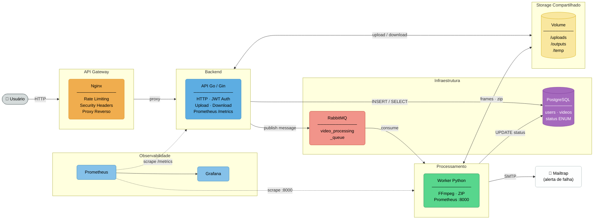

# Arquitetura — FIAP X

---

| Componente | Tecnologia | Responsabilidade |
|:---|:---|:---|
| **API Gateway** | Nginx | Rate limiting, security headers, proxy reverso |
| **API Backend** | Go 1.25 + Gin | Autenticação JWT, upload, orquestração de fluxo |
| **Worker** | Python 3.11 + Pika | Consumo de fila, FFmpeg, geração de ZIP |
| **Mensageria** | RabbitMQ 4 | Desacoplamento assíncrono entre API e Worker |
| **Banco de Dados** | PostgreSQL 16 | Usuários, vídeos e ciclo de vida do processamento |
| **Storage** | Volume Docker / K8s PVC | Compartilhamento de arquivos entre API e Worker |
| **Observabilidade** | Prometheus + Grafana | Coleta e visualização de métricas em tempo real |
| **Notificação** | Mailtrap (SMTP) | Alerta por e-mail em caso de falha de processamento |
