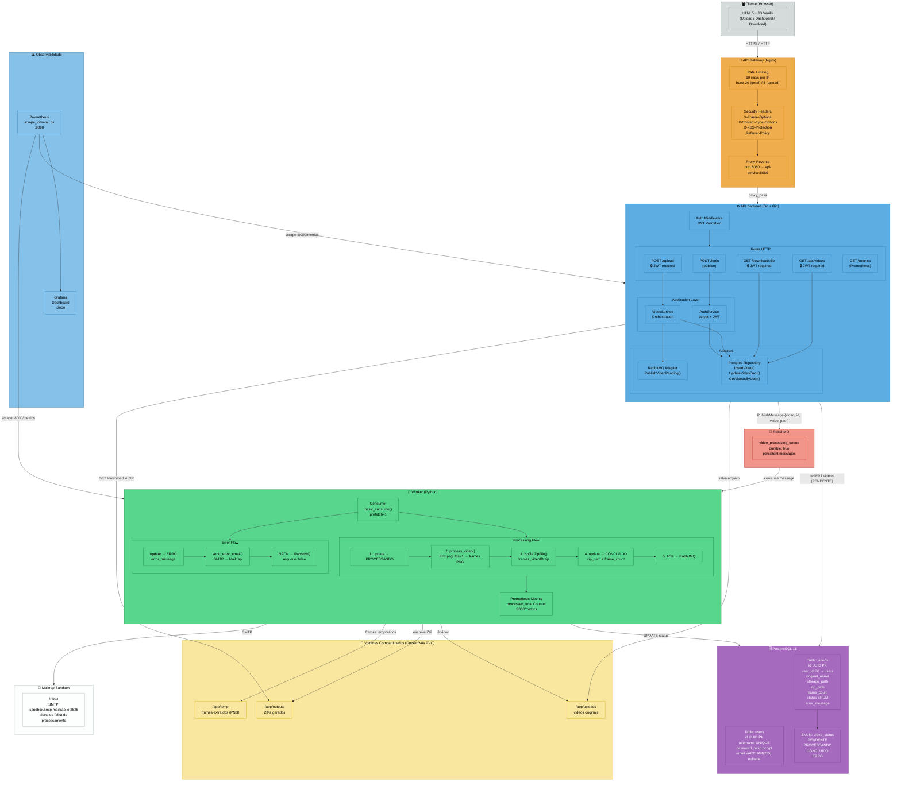
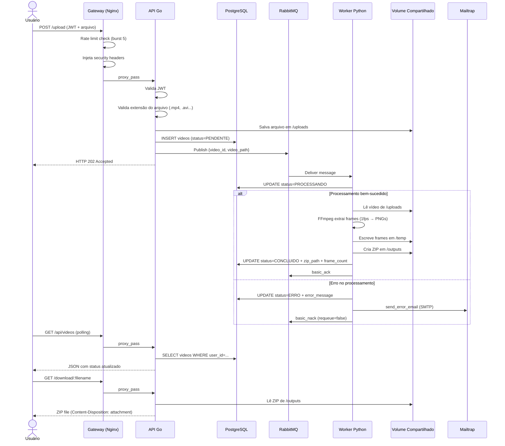

# Arquitetura Detalhada — FIAP X

Diagrama completo para referência interna. Cobre todos os componentes, fluxos de dados, protocolos, volumes compartilhados, segurança e observabilidade.

---

## Fluxo Completo de um Upload

